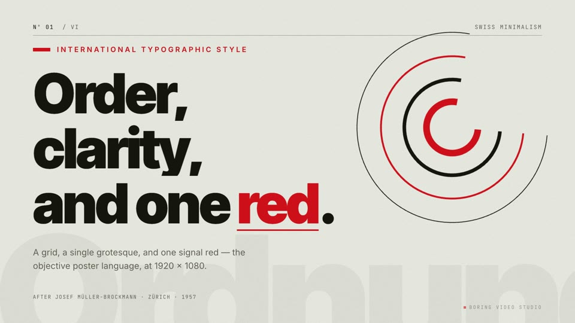
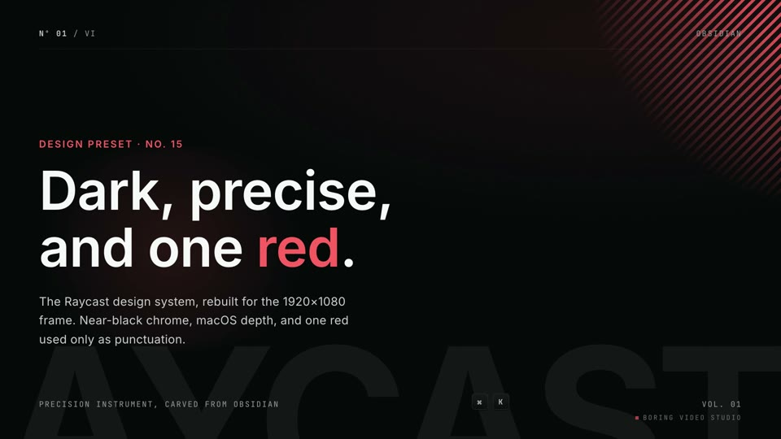
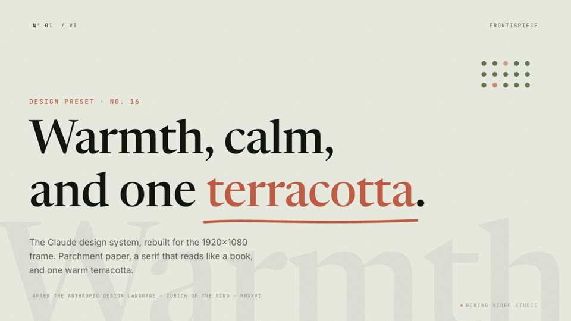

# boring-video-studio

**`verysmallwoods-video`** —— 小木头的个人视频流水线 Agent Skill。一个主题、一篇文章,或一份口播稿 → 一整套可发布物料:**视频成片 + 五比例封面 + 平台文案 + 博客 + 推文**,一次会话交付。视频本体用 [HyperFrames](https://www.hyperframes.dev)(HTML 即视频)搭合成、逐帧动效、渲染,本地零成本。

为 [Claude Code](https://claude.com/claude-code) 等支持 [Agent Skills](https://skills.sh) 的工具准备。

[](https://skills.sh/sugarforever/boring-video-studio)

## 有什么 · 做什么

唯一的 skill 是 **`verysmallwoods-video`**(在 `skills/`),当**编排者**:你给一个选题,它一路产到整套能直接发的物料,而不只是一个 mp4。它自带一套可扩展的 **HyperFrames 设计预设**(配色 / 字体 / 版式 / 字幕皮肤),决定成片的整体观感。下面是三套预设的演示成片 —— 真转场 + 逐帧动效,不是「会动的 PPT」,点封面看 30 秒:

| [](https://youtu.be/VQhtHXWUViE) | [](https://youtu.be/KtlchbTKO_Q) | [](https://youtu.be/_2I6qFP7Tks) |
|:--:|:--:|:--:|
| **Swiss Minimalism** · 网格 + 信号红 | **Raycast Dark** · 暗色 + macOS 质感 | **Claude Warm** · 羊皮纸 + 衬线 + 赤陶 |

预设源码在 `skills/verysmallwoods-video/references/frame-presets/`,演示工程在 `demo/`。

## 怎么用

```bash
npx skills add sugarforever/boring-video-studio
```

装好后直接开口,例如「帮我把这篇文章做成一期视频」—— skill 先问你选**设计预设**与**旁白来源**(自录 / TTS),再一路产到整套物料。需要本机 HyperFrames 工具链(`npx hyperframes doctor`:Node ≥ 22 · FFmpeg · Chrome)。

## 相较于直接用 HyperFrames

HyperFrames 出的是**一个 mp4**;`verysmallwoods-video` 在它之上做**编排 + 口径**,多补这些:

- **一整套物料,不止成片** —— 五比例封面 + YouTube / Bilibili 文案 + 博客 + 推文,按交付清单缺一不可。
- **设计预设选择** —— 开局选一套预设(Swiss / Raycast / Claude / …),整期观感统一、可复用、可扩展。
- **旁白多一条自录路** —— 除 TTS 外,支持用户自录音频 + SRT,自动校对 / 切段 / 对齐 / 重排到真实 cue。
- **「视频不是 PPT」的设计口径** —— 优先用动效 / 图形 / 图表表达,优先调用 `/hyperframes-animation` 与 `/hyperframes-creative`,而非静态文字堆叠。

## 致谢 · License

`raycast-dark` / `claude-warm` 设计预设的灵感来自 [Open Design](https://github.com/nexu-io/open-design)(nexu-io · MIT)的 design systems;`swiss-minimalism` 为原创,取法 Müller-Brockmann。MIT License。
